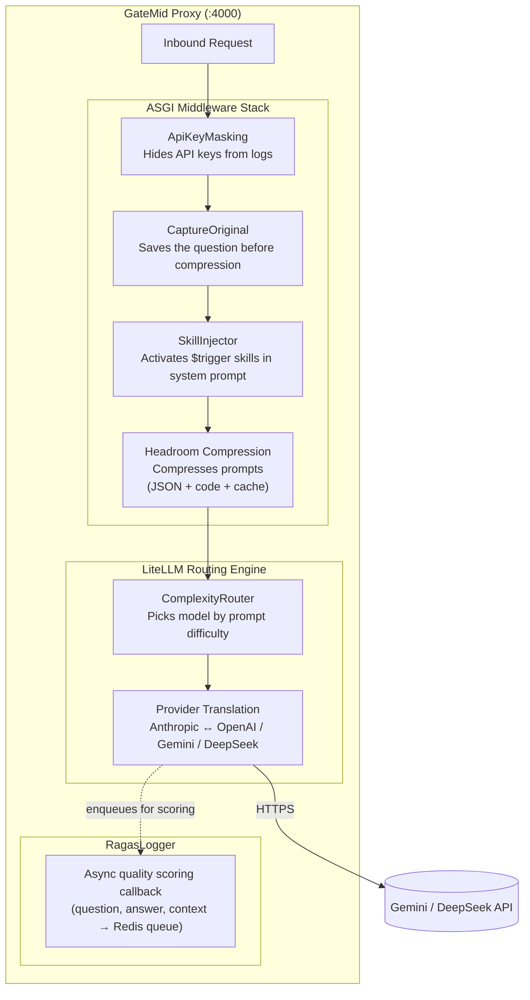
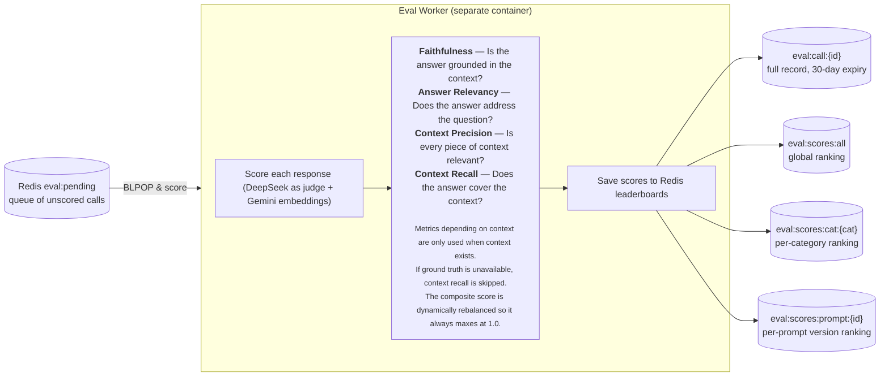
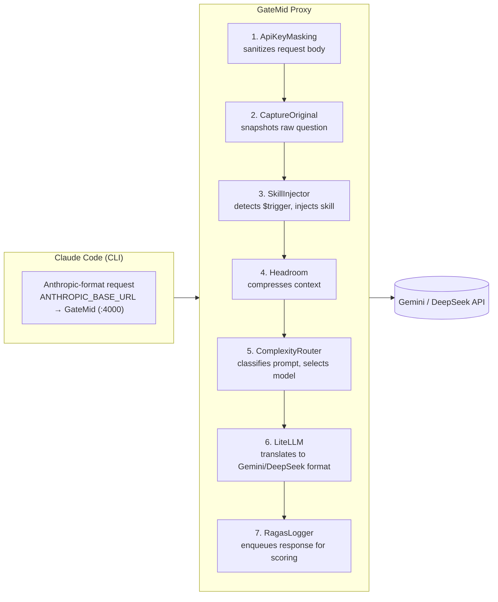
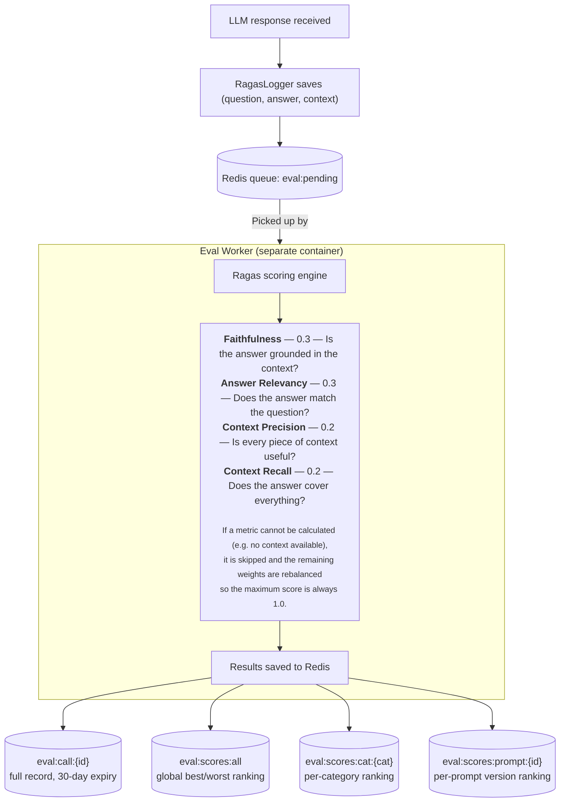

# GateMid — AI Gateway Middleware

Local-dev AI gateway combining [Headroom](https://github.com/chopratejas/headroom) context compression (ASGI middleware) with [LiteLLM](https://github.com/BerriAI/litellm) auto-routing and async [Ragas](https://docs.ragas.io/) quality scoring.

**What it does:**
- Compresses prompts before they reach the LLM (60-95% token savings)
- Automatically routes queries to the right model by complexity
- Activates skill directives via `$trigger` tokens (e.g., `$ponytail` for minimalism, `$caveman` for ultra-concise output) — single or multiple skills injected into the system prompt before compression
- Asynchronously scores every response for quality (faithfulness, relevancy, precision)
- Drop-in proxy — works with Claude Code, Open Code, and any OpenAI-compatible SDK

---

## Architecture

### Inbound flow



### Eval worker (separate container)


### Key architectural decisions

| Decision | Choice | Rationale |
|----------|--------|-----------|
| Middleware approach | **ASGI middleware** (not LiteLLM callbacks) | More reliable — fires at HTTP level on every request, covers all routes including streaming |
| Entrypoint | **Custom `entrypoint.py`** (not `--startup_file`) | Full control over Headroom patches, middleware order, and logger configuration |
| Routing timing | **Route before compress** | ComplexityRouter sees original (uncompressed) prompt for correct classification; compression happens at ASGI level after routing resolves the target model |
| Compression model | **SmartCrusher only** (Kompress disabled) | Target is JSON/FHIR/HL7 payloads — ONNX model adds 100-200ms latency and ~500MB download for no benefit |
| Evaluation model | **Direct DeepSeek client** (bypasses LiteLLM) | Eval worker avoids competing for proxy resources with user requests |
| Loop prevention | **Model prefix + metadata flag** | Two independent checks prevent Ragas from scoring its own calls |

---

## Quick Start

### 1. Clone and set API keys

```bash
git clone <repo-url> llm-mid && cd llm-mid
cp .env.example .env
# Edit .env with your actual GEMINI_API_KEY and DEEPSEEK_API_KEY
```

### 2. Start the gateway

```bash
docker compose up -d
```

Verify it's running:

```bash
curl -s http://localhost:4000/health -H "Authorization: Bearer sk-local-dev-key" | head -c 200
```

### 3. Quick tool setup (pick one)

**Option A — Automated setup script:**

```bash
# Interactive — picks the tool for you
./setup-gatemid.sh

# Or non-interactive with env vars
GATEMID_URL=http://localhost:4000 GATEMID_API_KEY=sk-local-dev-key ./setup-gatemid.sh

# Revert when done
./setup-gatemid.sh --uninstall
```

The script supports **Claude Code** and **OpenCode** — it writes the correct config file for each, creates a timestamped backup of your existing settings, and handles uninstall cleanly.

<details>
<summary><strong>Option B — Manual setup</strong> (click to expand)</summary>

## Claude Code Setup

Configure Claude Code to route through GateMid. All prompts get compressed and auto-routed to the best model.

> **Quick alternative:** `./setup-gatemid.sh` does this automatically (see [Quick Start](#3-quick-tool-setup-pick-one)).

### Step 1: Configure environment

Add to your shell profile (`~/.zshrc`, `~/.bashrc`, etc.):

```bash
export ANTHROPIC_BASE_URL="http://localhost:4000"
export ANTHROPIC_API_KEY="sk-local-dev-key"
export ANTHROPIC_MODEL="team-smart-router"
export ANTHROPIC_DEFAULT_HAIKU_MODEL="deepseek-flash"
export ANTHROPIC_DEFAULT_SONNET_MODEL="deepseek-pro"
```

Then reload:

```bash
source ~/.zshrc  # or ~/.bashrc
```

### Step 2: Run Claude Code

```bash
claude
```

Claude Code now sends all requests through GateMid. The complexity router classifies each prompt and picks the right model. Headroom compresses large contexts automatically.

### How it works



> **Note:** GateMid translates between Anthropic and OpenAI/Gemini/Deepseek formats automatically via LiteLLM's provider abstraction. Claude Code's tool use, streaming, and system prompts all work.

### Per-project model overrides

Create `~/.claude/settings.json` to pin specific models per project or override the router:

```json
{
  "env": {
    "ANTHROPIC_BASE_URL": "http://localhost:4000",
    "ANTHROPIC_API_KEY": "sk-local-dev-key",
    "ANTHROPIC_MODEL": "team-smart-router",
    "ANTHROPIC_DEFAULT_HAIKU_MODEL": "deepseek-flash",
    "ANTHROPIC_DEFAULT_SONNET_MODEL": "deepseek-pro"
  }
}
```

### Bypassing the router

To use a specific model directly (no auto-routing):

```bash
export ANTHROPIC_MODEL="deepseek-pro"
claude
```

Available models (configurable via `./quick-setup.sh`): `gemini-flash`, `deepseek-flash`, `gemini-pro`, `deepseek-pro`, `claude-sonnet`, `claude-fable`, `claude-opus`, `openai-gpt4o`, `openai-o3`, `copilot-gpt4`, `copilot-codex`, `github-llama`, `team-smart-router`

---

## Open Code Setup

Open Code supports OpenAI-compatible backends natively.

> **Quick alternative:** `./setup-gatemid.sh` does this automatically (see [Quick Start](#3-quick-tool-setup-pick-one)).

### Step 1: Configure environment

Add to your shell profile:

```bash
export OPENAI_BASE_URL="http://localhost:4000/v1"
export OPENAI_API_KEY="sk-local-dev-key"
```

### Step 2: Create Open Code config

Create `~/.config/opencode/opencode.json`:

```json
{
  "$schema": "https://opencode.ai/config.json",
  "provider": {
    "gatemid": {
      "npm": "@ai-sdk/openai-compatible",
      "name": "GateMid",
      "options": {
        "baseURL": "{env:OPENAI_BASE_URL}",
        "apiKey": "{env:OPENAI_API_KEY}"
      },
      "models": {
        "team-smart-router": { "name": "team-smart-router" },
        "gemini-flash": { "name": "gemini-flash" },
        "gemini-pro": { "name": "gemini-pro" },
        "deepseek-flash": { "name": "deepseek-flash" },
        "deepseek-pro": { "name": "deepseek-pro" }
      }
    }
  }
}
```

### Step 3: Run Open Code

```bash
opencode
```

Use `/connect` in the Open Code CLI and select the **GateMid** provider, or set the default model to `team-smart-router` for automatic routing.

</details>

---

## How Routing Works

The **complexity router** (`team-smart-router`) is a local, rule-based classifier — sub-millisecond, zero external API calls. It analyzes each prompt across seven weighted dimensions:

| Dimension | Weight | Purpose |
|-----------|--------|---------|
| `reasoningMarkers` | 0.30 | Step-by-step, analysis, debugging — strongest signal |
| `simpleIndicators` | 0.15 | Greetings, yes/no questions — helps classify simple prompts correctly |
| `codePresence` | 0.10 | Code blocks, API patterns |
| `technicalTerms` | 0.10 | Domain-specific terminology |
| `tokenCount` | 0.05 | Prompt length (system prompt adds baseline tokens) |
| `multiStepPatterns` | 0.05 | Multi-part instructions |
| `questionComplexity` | 0.05 | Question structure depth |

**Classification boundaries:**

| Tier | Score Range | Model | Use Case |
|------|-------------|-------|----------|
| SIMPLE | 0.00 – 0.20 | deepseek-flash (default) | Greetings, definitions, yes/no |
| MEDIUM | 0.20 – 0.45 | deepseek-flash (default) | General queries (default fallback) |
| COMPLEX | 0.45 – 0.65 | deepseek-pro (default) | Code, architecture, technical |
| REASONING | 0.65+ | deepseek-pro (default) | Step-by-step, analysis, debugging |

Token thresholds are tuned for Claude Code's ~500+ token system prompt: `simple` at 100 tokens, `complex` at 2000 tokens.

---

## Scoring & Evaluation

Every LLM response is scored asynchronously for quality using Ragas. The eval-worker runs in a separate container so scoring never impacts request latency.

### Scoring pipeline



### View scores

```bash
# Top 20 best and worst calls across all categories
docker exec gatemid-headroom python -m eval.cli score

# Top 10 worst FHIR query calls
docker exec gatemid-headroom python -m eval.cli score --category fhir_query --n 10

# Filter by prompt version
docker exec gatemid-headroom python -m eval.cli score --prompt-id v2_system_prompt
```

### Interactive score board

For a full-screen, keyboard-navigable view of scored calls, use the interactive TUI:

```bash
# Start the interactive score board (shows Best calls first)
docker exec -it gatemid-headroom python -m eval.cli score

# Filter by category
docker exec -it gatemid-headroom python -m eval.cli score --category fhir_query

# Show more records
docker exec -it gatemid-headroom python -m eval.cli score --n 50
```

**Control reference:**

| Key | Action |
|---|---|
| `↑` / `↓` | Scroll through records in the current view |
| `Tab` / `←` / `→` | Switch between **Best** and **Worst** scoring calls |
| `Enter` / `Space` | Open the full detail view for the selected record |
| `Esc` / `q` | Close the detail view and return to the score board |
| `q` | Quit the score board |

The full detail view shows everything without truncation: **call ID, composite score (full precision), request category, model name, prompt version, token counts, timestamp, per-dimension ragas scores (faithfulness\*, relevancy\*, context precision\*, context recall\*\*), the complete question, and the complete answer.** Close it with `Esc`, `q`, or `Enter` to resume browsing.

> **Metric availability:**
> - Faithfulness and context precision are only scored when the call has retrieved contexts.
> - Context recall and context precision additionally require a ground truth answer.
> - When a metric is unavailable the composite is dynamically re-normalised so it always maxes at 1.0.
> - For calls without any retrieved context the composite is driven by answer relevancy alone.

> **Note:** Requires `-it` (interactive TTY) for TUI rendering. Uses [Rich](https://github.com/Textualize/rich) for terminal rendering (already installed in the eval-worker container).

The eval-worker uses DeepSeek as the LLM-as-judge (via direct OpenAI-compatible client) and Gemini for embeddings (via lightweight httpx — no PyTorch required).

---

## Compression Analytics

Every compressed request is logged to Redis with token-before/after/saved counts and per-day aggregates. The interactive viewer shows daily and per-call breakdowns.

### Interactive compression board

```bash
# Show last 10 days of compression stats
docker exec -it gatemid-headroom python -m eval.cli headroom

# Show more days
docker exec -it gatemid-headroom python -m eval.cli headroom --days 14
```

**Control reference:**

| Key | Action |
|---|---|
| `↑` / `↓` | Scroll through daily stats |
| `Enter` / `Space` | Drill into per-call details for the selected day |
| `Esc` / `q` | Go back from detail view / return to days |
| `q` | Quit the viewer |

**Top bar** shows running grand totals: total tokens saved, percent reduction, and total compressed calls across all time.

**Daily detail view** shows every compression call for that day: timestamp, model, tokens before/after/saved, compression ratio, and which transforms were applied (SmartCrusher, CodeCompressor, CacheAligner).

> **Note:** Requires `-it` (interactive TTY) for TUI rendering. Uses [Rich](https://github.com/Textualize/rich) for terminal rendering (already installed in both containers).

**Redis data layout (compression):**

| Key | Type | Purpose |
|-----|------|---------|
| `headroom:call:{call_id}` | Hash | Individual compression result (30d TTL) |
| `headroom:day:{YYYY-MM-DD}` | Hash | Daily aggregate (tokens saved, call count) |
| `headroom:days` | ZSet | Date index for listing latest N days |
| `headroom:totals` | Hash | Running grand totals |

### Clear Redis data for a fresh test

```bash
# Remove all eval:* keys (surgical — queues, scores, metadata)
docker exec gatemid-headroom python -m eval.cli clear-redis

# Nuclear option — wipes ALL keys in the Redis DB
docker exec gatemid-headroom python -m eval.cli clear-redis --hard
```

Programmatic use:

```python
from eval.redis_store import flush_eval
flush_eval()  # returns count of deleted keys
```

---

## Custom Middleware Stack

Four custom ASGI middlewares are registered on the LiteLLM FastAPI app. Registration order is critical — FastAPI/Starlette applies middleware in reverse (last registered = outermost).

### 1. ApiKeyMaskingMiddleware (outermost)

**File:** `proxy/guardrails/api_key_masking.py`

Sanitizes API keys from request/response bodies before any other middleware or logging sees them. Uses 8 ordered regex patterns covering Gemini (`AIzaSy`), Hugging Face (`hf_`), GitHub tokens, AWS access keys, OpenAI/Anthropic (`sk-`), Bearer tokens, and generic 36+ char strings. Preserves key type prefixes while masking the sensitive portion.

### 2. CaptureOriginalQuestionMiddleware

**File:** `proxy/capture_original.py`

Buffers the full request body before Headroom compression transforms it. Scans messages in reverse for the last user message and injects `metadata.original_question` into the LiteLLM request body. This ensures the eval system scores the real user question, not the compressed version.

### 3. SkillInjectorMiddleware

**File:** `proxy/skill_injector.py`  ·  **Registry:** `proxy/skills/registry.py`  ·  **Skills:** `proxy/skills/*.md`

Detects `$<skill-name>` trigger tokens (e.g. `$ponytail`, `$caveman`) in user messages, strips the tokens from the forwarded message, and injects the corresponding skill markdown into the system prompt. **Supports multiple triggers** in a single message (e.g. `$caveman $ponytail summarise this`) — all matched skills are injected, alphabetically ordered, with each dedup-checked individually. Injection happens **before** Headroom compression so the skill text is compressed with the rest of the payload, minimising net token overhead (~150–250 tokens after compression for a typical ~500-token skill).

**How it works:**
1. Scans user messages for ALL `$`-prefixed triggers (e.g. `$ponytail`, `$caveman`)
2. Looks up each trigger in the skill registry (loaded from `proxy/skills/*.md` at startup)
3. Strips ALL `$trigger` tokens from the user message
4. Appends all matched skill contents to the system prompt (alphabetically ordered, no duplicates)
5. Sets response header `X-GateMid-Skill-Applied: <skill-names>` (comma-separated for multiple)
6. Records `skill_name` (comma-separated if multiple) and `skill_tokens_pre_compression` in Redis

**Supported skills:**

Skills are auto-discovered from every `.md` file in `proxy/skills/` at startup.

| Trigger | Skill | Effect |
|---|---|---|
| `$ponytail` | [Ponytail](https://github.com/DietrichGebert/ponytail) — The Minimalism Ladder | 7-rung YAGNI ladder: question existence → reuse → stdlib → native → one-liner → minimum. Cuts LOC by ~54%, cost by ~20%, response time by ~27%. |
| `$caveman` | [Caveman](https://github.com/juliusbrussee/caveman) — ultra-compressed output | Cuts output tokens ~65-75% while preserving technical accuracy. Drops filler, uses fragments. Supports levels: lite / full (default) / ultra / wenyan. |

**Usage:** Include one or more skill triggers anywhere in your message:

```markdown
Refactor this service $ponytail
```

Or combine multiple skills in a single message (both are injected into the system prompt):

```markdown
Write this module $caveman $ponytail
```

Triggers are stripped before the LLM sees them — only the skill system prompts remain. Activated skill names are returned in the `X-GateMid-Skill-Applied` response header (comma-separated for multiple).

**Adding your own skills:**

Drop a new `.md` file into `proxy/skills/` and it's live — no code changes, no config reload needed.

1. Create `proxy/skills/<name>.md` with your skill prompt (markdown, any length)
2. Restart the proxy (or call `load_skills()` if running in-process)
3. Use `$<name>` in any message to activate it

| Trigger format | `$<skill-name>` where `skill-name` matches the filename stem (case-insensitive). |
|-|-|

The skill content is injected into the system prompt **before** Headroom compression so it gets compressed with the rest of the payload (~150-250 tokens after compression for a typical ~500-token skill).

**Edge cases:**

| Scenario | Behaviour |
|---|---|
| Unknown trigger (`$unknownskill`) | Payload passes through unchanged, no error |
| Multiple triggers in one message | All valid triggers are matched, stripped, and injected (alphabetical, no duplicates) |
| Multipart (list) message content (Anthropic `/v1/messages`) | Scanned block-by-block; text blocks are checked for triggers |
| Missing/empty skill file | Skipped at load time with WARNING log |
| Non-JSON request body | Middleware no-ops, passes through |

### 4. Headroom CompressionMiddleware (innermost)

**File:** `headroom.integrations.asgi` (third-party, locally patched)

Three headroom patches are applied at startup in `proxy/entrypoint.py`:

| Patch | What it does |
|-------|-------------|
| `compress_user_messages=True` | Headroom default is `False` — forces compression on user messages |
| `enable_kompress=True` | Enables SmartCrusher for JSON payloads |
| `skip_user_messages=False` | Ensures ContentRouter doesn't skip user payloads |

---

## Project Map

| Layer | File | Purpose |
|-------|------|---------|
| **Entrypoint** | `proxy/entrypoint.py` | Custom startup — registers ASGI middleware, patches Headroom, starts LiteLLM |
| **Config** | `litellm_config.yaml` | Model definitions, complexity router config, callback registration |
| **Middleware** | `proxy/guardrails/api_key_masking.py` | API key sanitization (8 regex patterns) |
| **Middleware** | `proxy/capture_original.py` | Pre-compression question snapshot |
| **Middleware** | `proxy/skill_injector.py` | `$trigger` detection and skill injection into system prompt |
| **Skill Registry** | `proxy/skills/` | Skill markdown files loaded at startup (`ponytail.md`, `caveman.md` + future skills) |
| **Middleware** | `proxy/startup.py` | (Legacy) replaced by `entrypoint.py` |
| **Callback** | `proxy/callback.py` | `RagasLogger` — captures LLM responses and enqueues for scoring |
| **Eval** | `eval/worker.py` | Ragas scoring logic — `score_record()`, `compute_composite()`, `eval_worker()` loop |
| **Eval** | `eval/worker_main.py` | Eval-worker entrypoint — configures judge LLM + embeddings |
| **Eval** | `eval/redis_store.py` | Redis data layer — queue management, scored records, leaderboards |
| **Eval** | `eval/score_view.py` | CLI for querying best/worst scoring calls |
| **Eval** | `eval/cli.py` | Centralized CLI — `python -m eval.cli {score|headroom|clear-redis}` |
| **Eval** | `eval/score_view_interactive.py` | Interactive TUI score board (invoked via `eval.cli score`) |
| **Eval** | `eval/headroom_view_interactive.py` | Interactive TUI headroom stats (invoked via `eval.cli headroom`) |
| **Eval** | `eval/clear_redis.py` | CLI for clearing eval data (invoked via `eval.cli clear-redis`) |
| **Eval** | `eval/gemini_embeddings.py` | Lightweight Gemini embeddings (httpx, no PyTorch) |
| **Infra** | `docker-compose.yml` | Three services: proxy, redis, eval-worker |
| **Infra** | `proxy/Dockerfile` | Proxy container build |
| **Infra** | `eval/Dockerfile` | Eval-worker container build |
| **Tests** | `tests/` | Test suite: routing, compression, guardrails, callback, ragas, redis |

---

## Running Tests

```bash
# With the gateway running:
pip install pytest openai httpx
GATEMID_URL=http://localhost:4000 pytest tests/ -v
```

Test coverage:

| Test file | What it covers |
|-----------|---------------|
| `tests/test_routing.py` | Complexity router classifies prompts into correct tiers |
| `tests/test_compression.py` | Headroom compression produces valid responses |
| `tests/test_guardrails.py` | API key masking regex patterns (unit + integration) |
| `tests/test_skill_injector.py` | Skill registry + trigger detection + system prompt injection |
| `tests/test_callback.py` | RagasLogger skip logic and enqueue behavior |
| `tests/test_ragas_runner.py` | `score_record()` and `compute_composite()` logic |
| `tests/test_redis_store.py` | Redis queue and leaderboard operations |

---

## Configuration Reference

| File | Purpose |
|------|---------|
| `litellm_config.yaml` | Model routing, complexity router, provider config, callbacks |
| `proxy/skill_injector.py` | `$trigger` detection, skill injection, response header |
| `proxy/skills/registry.py` | Skill file loader — scans `proxy/skills/*.md` at startup |
| `proxy/skills/` — `ponytail.md`, `caveman.md` (+ your skills) | Skill markdown files — add a new `.md` to add a new skill |
| `proxy/entrypoint.py` | ASGI middleware registration, Headroom patches, logger config |
| `docker-compose.yml` | Three-service Docker deployment |
| `.env` | Provider API keys (never commit) |

See [LiteLLM Proxy docs](https://docs.litellm.ai/docs/proxy/configs) and [Headroom docs](https://headroom-docs.vercel.app/) for all options.

---

## Troubleshooting

### Gateway fails to start

```bash
docker compose logs litellm
```

Common issues:
- **Missing API keys**: Ensure `.env` has valid `GEMINI_API_KEY`, `DEEPSEEK_API_KEY`, etc. Run `./quick-setup.sh` to configure.
- **Port conflict**: Port 4000 already in use? Change `docker-compose.yml` ports mapping
- **Docker build fails**: Ensure Docker Desktop is running and you have internet access for pip

### Claude Code can't connect

```bash
# Verify the gateway is reachable
curl -s http://localhost:4000/health -H "Authorization: Bearer sk-local-dev-key"

# Check your env vars are set
echo $ANTHROPIC_BASE_URL
echo $ANTHROPIC_API_KEY
```

### Open Code can't connect

```bash
# Verify the OpenAI-compatible endpoint
curl -s http://localhost:4000/v1/models -H "Authorization: Bearer sk-local-dev-key"
```
